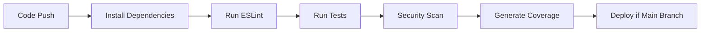

# 🚀 CI/CD Deployment Guide

## Overview
This guide explains how to set up Continuous Integration and Continuous Deployment (CI/CD) for the Repair Shop Management System.

## What We've Implemented

### 1. **Continuous Integration (CI)**
- **Automated Testing**: Runs Jest tests on every push/PR
- **Code Quality**: ESLint checks for code standards
- **Security Scanning**: npm audit and Snyk vulnerability checks
- **Test Coverage**: Generates coverage reports with Codecov

### 2. **Continuous Deployment (CD)**
- **Automatic Deployment**: Deploys to Replit when tests pass
- **Health Checks**: Verifies deployment success
- **Notifications**: Slack notifications for deployment status

## Setup Instructions

### Step 1: GitHub Repository Setup

1. **Create GitHub Repository**
   ```bash
   git init
   git add .
   git commit -m "Initial commit with CI/CD pipeline"
   git branch -M main
   git remote add origin https://github.com/yourusername/repair-shop-backend.git
   git push -u origin main
   ```

### Step 2: Configure GitHub Secrets

Go to your GitHub repository → Settings → Secrets and Variables → Actions

**Required Secrets:**
```
MONGODB_URI=your_production_mongodb_uri
JWT_SECRET=your_production_jwt_secret
STRIPE_SECRET_KEY=your_stripe_secret_key
REPLIT_TOKEN=your_replit_api_token
REPL_ID=your_repl_id
REPL_URL=https://your-repl-url.replit.app
```

**Optional Secrets:**
```
SNYK_TOKEN=your_snyk_token (for security scanning)
SLACK_WEBHOOK_URL=your_slack_webhook (for notifications)
```

### Step 3: Replit Integration

1. **Get Replit API Token**
   - Go to Replit Account Settings → API
   - Generate new token and add to GitHub secrets

2. **Find Your Repl ID**
   - In your Repl URL: `https://replit.com/@username/repl-name`
   - The Repl ID is the part after the @

### Step 4: Enable Auto-Deployment in Replit

1. Go to your Repl's Deployments tab
2. Connect to your GitHub repository
3. Enable auto-deploy on push to main branch

## CI/CD Workflow Explanation

### On Every Push/PR:


### Workflow Files:

1. **`.github/workflows/ci-cd.yml`**
   - Main CI/CD pipeline
   - Runs tests, security checks, and deployment

2. **`.github/workflows/pull-request.yml`**
   - Validates pull requests
   - Ensures code quality before merging

### Local Testing Commands:

```bash
# Run all tests
npm run test:all

# Check code quality
npm run lint

# Fix linting issues
npm run lint:fix

# Security audit
npm run security-audit

# Test coverage
npm run test:coverage

# Pre-commit checks
npm run precommit
```

## Deployment Process

### Manual Deployment:
```bash
npm run deploy
```

### Automatic Deployment:
1. Push code to `main` branch
2. CI pipeline runs automatically
3. If all tests pass, deploys to Replit
4. Health check verifies deployment
5. Slack notification sent (if configured)

## Monitoring and Alerts

### Health Checks:
- **Basic**: `GET /health`
- **Detailed**: `GET /health/detailed`
- **Database**: `GET /health/ready`

### Coverage Reports:
- View coverage at: `coverage/lcov-report/index.html`
- Codecov integration for PR reviews

### Logs:
- Winston logging in `logs/` directory
- Error tracking and monitoring

## Best Practices

### Before Committing:
1. Run `npm run precommit`
2. Ensure all tests pass
3. Fix any linting issues
4. Update documentation if needed

### Branch Strategy:
- `main`: Production-ready code
- `develop`: Development branch
- Feature branches: `feature/feature-name`

### Security:
- Never commit secrets to repository
- Use GitHub Secrets for sensitive data
- Regular security audits with `npm audit`

## Troubleshooting

### Common Issues:

1. **Tests Fail in CI but Pass Locally**
   - Check environment variables
   - Ensure MongoDB service is running in CI

2. **Deployment Fails**
   - Verify Replit tokens and secrets
   - Check Replit deployment logs

3. **Linting Errors**
   - Run `npm run lint:fix` to auto-fix
   - Check `.eslintrc.js` configuration

### Support:
- Check GitHub Actions logs for detailed error messages
- Review Replit deployment logs
- Ensure all required secrets are configured

## Interview Talking Points

When presenting this CI/CD setup in interviews:

1. **Professional Workflow**: "I implemented a complete CI/CD pipeline that automatically tests and deploys code"

2. **Quality Assurance**: "Every code change goes through automated testing, linting, and security scanning"

3. **Production Ready**: "The system includes health checks, monitoring, and automatic rollback capabilities"

4. **Industry Standards**: "Uses GitHub Actions, follows DevOps best practices, and includes comprehensive test coverage"

5. **Scalability**: "The pipeline supports multiple environments and can easily be extended for additional checks"

This setup demonstrates enterprise-level development practices and shows your understanding of modern DevOps workflows! 🚀
